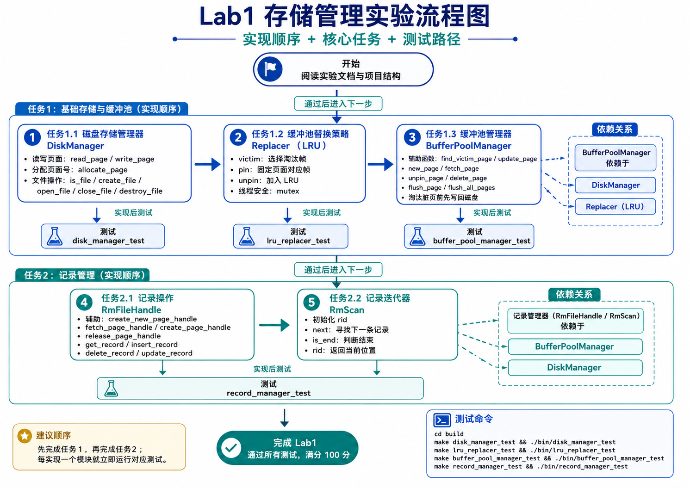

# Lab 1：存储管理

开始实验前，请先按照 [RUCBase 使用文档](RUCBase使用文档.md) 完成构建和测试环境配置。



## 任务一 缓冲池管理器

数据在磁盘文件中是按照页面（Page）形式组织的。为避免直接访问磁盘数据页面而造成高昂的I/O开销，存储子系统在内存中创建缓冲池（Buffer Pool）来缓存部分磁盘数据页面。缓冲池维护固定数量的内存页面，每个内存页面称为“帧”（Frame），一般情况下，每一帧的大小与磁盘数据页面的大小保持一致。受制于内存容量，缓冲池只能缓存部分数据页面。因此，缓冲池管理的目标，就是在受限缓冲池大小的前提下，设计合适的内外存页面调度策略，尽可能将经常访问的磁盘数据页面维护在缓冲池中，从而减少磁盘I/O开销。

本实验涉及缓冲池管理的重要内容，学生需要实现数据库存储系统中的缓冲池管理器，即`BufferPoolManager`类。它的数据结构包括`Page`、`DiskManager`、`Replacer`类的对象等。其中，`Page`类已提供，不需要实现，其路径位于`src/storage/page.h`。

本实验要求学生依次完成三个子任务，实现`DiskManager`、`Replacer`、`BufferPoolManager`类的接口。

### 任务1.1 磁盘存储管理器

本任务要求补全`DiskManager`类，其负责读写指定页面、分配页面编号，以及对文件进行操作。

`DiskManager`类的接口如下：

```cpp
class DiskManager {
   public:
    explicit DiskManager();        // Constructor
    ~DiskManager() = default;    // Destructor
    // 读写页面
    void write_page(int fd, page_id_t page_no, const char *offset, int num_bytes);
    void read_page(int fd, page_id_t page_no, char *offset, int num_bytes);
    // 对指定文件分配页面编号
    page_id_t allocate_page(int fd);
    // 文件操作
    bool is_file(const std::string &path);
    void create_file(const std::string &path);
    int open_file(const std::string &path);
    void close_file(int fd);
    void destroy_file(const std::string &path);
}
```

这些接口的内部实现调用了Linux操作系统下`/usr/include/unistd.h`提供的`read()`、`write()`、`open()`、`close()`，`unlink()`等函数。

（1）读写页面

- `void write_page(int fd, page_id_t page_no, const char *offset, int num_bytes);`

- `void read_page(int fd, page_id_t page_no, char *offset, int num_bytes);`

    提示：可以调用`read()`或`write()`函数。通过(fd,page_no)可以定位指定页面及其在磁盘文件中的偏移量。注意：这里支持读写的字节长度为`num_bytes`，上层调用此函数读写页面时，其值一般为页面大小`PAGE_SIZE`。但有时也可以小于`PAGE_SIZE`，比如只读写页头数据。

（2）分配页面编号

- `page_id_t allocate_page(int fd);`

    目前采取简单的自增分配策略：指定文件的页面编号加1。

（3）文件操作

- `bool is_file(const std::string &path);`

    用于判断指定路径文件是否存在。

    提示：用`struct stat`获取文件信息。

- `void create_file(const std::string &path);`

    用于创建指定路径文件。

    提示：调用`open()`函数，使用`O_CREAT`模式。注意不能重复创建相同文件。

- `void open_file(const std::string &path);`

    用于打开指定路径文件。

    提示：调用`open()`函数，使用`O_RDWR`模式。注意不能重复打开相同文件，并且需要更新文件打开列表。

- `void close_file(int fd);`

    用于关闭指定路径文件。

    提示：调用`close()`函数。注意不能关闭未打开的文件，并且需要更新文件打开列表。

- `void destroy_file(const std::string &path);`

    用于删除指定路径文件。

    提示：调用`unlink()`函数。注意不能删除未关闭的文件。

### 任务1.2 缓冲池替换策略

本任务要求补全`Replacer`类，其负责跟踪缓冲池中每个页面所在帧的使用情况。当缓冲池没有空闲页面时，需要使用该类提供的替换策略选择一个页面进行淘汰。要求实现的替换策略为最近最少使用（LRU）算法。

`Replacer`类的接口如下：

```cpp
class Replacer {
   public:
    explicit Replacer(size_t num_pages);
    ~Replacer();
    bool victim(frame_id_t *frame_id);
    void pin(frame_id_t frame_id);
    void unpin(frame_id_t frame_id);
};
```

注意需要保证每个函数都是原子性的操作，可以使用`std::mutex`对每个函数上锁。

- `Replacer(size_t num_pages);`

    构造函数，初始化`LRUlist`的最大容量`max_size`。

- `bool victim(frame_id_t *frame_id);`

    当缓冲池要淘汰一个页面所在的帧，调用此函数。

    需要删除`LRUlist`中最远被unpin的帧，并传出该帧的编号。

- `void pin(frame_id_t frame_id);`

    当缓冲池要固定一个页面所在的帧，调用此函数。

    需要删除`LRUlist`中指定的帧，若该帧不存在则无任何操作。

- `void unpin(frame_id_t frame_id);`

    当缓冲池要取消固定一个页面所在的帧（该页面的`pin_count`变为0），调用此函数。

    需要将指定帧插入到`LRUlist`中最近被unpin的位置。

### 任务1.3 缓冲池管理器

本任务要求补全`BufferPoolManager`类，其负责管理缓冲池中的页面与磁盘文件中的页面之间的来回移动。

`BufferPoolManager`类的接口如下：

```cpp
class BufferPoolManager {
   public:
    BufferPoolManager(size_t pool_size, DiskManager *disk_manager);
    ~BufferPoolManager();
    Page *new_page(PageId *page_id);
    Page *fetch_page(PageId page_id);
    bool unpin_page(PageId page_id, bool is_dirty);
    bool delete_page(PageId page_id);
    bool flush_page(PageId page_id);
    void flush_all_pages(int fd);
   private:
    // 辅助函数
    bool find_victim_page(frame_id_t *frame_id);
    void update_page(Page *page, PageId new_page_id, frame_id_t new_frame_id);
}
```

框架另外提供了 move-only `PageGuard`，用于在作用域结束时自动调用 `unpin_page()`。`fetch_page_guard()` 和 `new_page_guard()` 只是对上述原始接口的 RAII 包装，不代替本实验对 `fetch_page()`、`new_page()` 和 `unpin_page()` 的实现要求。修改 guard 持有的页后应调用 `mark_dirty()`。

`BufferPoolManager::get_pin_snapshot()` 可以记录当前每个页面的 pin_count，测试可直接比较操作前后的快照来发现未释放的 pin。该检测是显式的：缓冲池析构时不会全局断言，因为部分 Lab1 用例会故意保持页面 pinned 以测试池耗尽场景。

注意要对缓冲池进行并发控制，可以像`Replacer`类那样直接用`std::mutex`对每个函数上锁。但这种方法实际上是顺序执行若干个原子性操作。学生可以考虑这些函数之间的并发执行逻辑，加以改进。

**学生可以自主添加私有辅助函数，将某些重复使用的逻辑模块化，例如寻找淘汰页、更新页表和页面等。不允许修改上述实验要求的原始公有函数声明；框架预先提供的 guard 和诊断接口不属于学生 TODO。**

首先，可以实现辅助函数：

- `bool find_victim_page(frame_id_t *frame_id);`

​	用于寻找淘汰页。

- `void update_page(Page *page, PageId new_page_id, frame_id_t new_frame_id);`

​	用于更新页表和页面。

然后实现public函数：

- `BufferPoolManager(size_t pool_size, DiskManager *disk_manager);`

    构造函数，需要初始化缓冲池的最大容量`pool_size`，以及分配`replacer`和`pages`的地址空间。

    初始时`free_list`中帧编号的范围为[0,pool_size)。

- `Page *new_page(PageId *page_id);`

    用于在内存申请创建一个新的页面。

    内部实现逻辑包括更新页表和页面、固定页面、寻找淘汰页等。

    此外，需要用`DiskManager`分配页面编号，并传出这个新页面的编号。

    提示：需要用到之前实现的接口`Replacer::pin()`、`Replacer::victim()`、`DiskManager::allocate_page()`等。

- `Page *fetch_page(PageId page_id);`

    用于获取缓冲池中的指定页面。

    内部实现逻辑包括更新页表和页面、固定页面、寻找淘汰页等。

    此外，如果缓冲池中不存在该页面，需要用`DiskManager`从磁盘中读取。

    提示：需要用到之前实现的接口`Replacer::pin()`、`Replacer::victim()`、`DiskManager::read_page()`等。

- `bool unpin_page(PageId page_id, bool is_dirty);`

    用于使用完页面后，对该页面取消固定。

    内部实现逻辑较简单，先减少页面的一次引用次数，由于页面可能同时被多个线程使用，调用一次`unpin_page()`只会减少一次引用次数，只有当引用次数减少到0时，才能调用`Replacer::unpin()`来取消固定页面所在的帧。

    参数`is_dirty`决定是否对页面置脏，如果上层修改了页面，就将该页面的脏标志置`true`。

- `bool delete_page(PageId page_id);`

    用于删除指定页面。

    内部实现逻辑包括更新页表和页面、更新空闲帧列表等。

    注意：只有引用次数为0的页面才能被删除。

- `bool flush_page(PageId page_id);`

    用于强制刷新（写入）缓冲池中的指定页面到磁盘。

    此处的"强制"指的是无论该页的引用次数是否大于0，无论该页是否为脏页，都将其刷新到磁盘。

- `void flush_all_pages(int fd);`

    用于将指定文件中的存在于缓冲池的所有页面都刷新到磁盘。

  注意，在上述所有函数的实现中，淘汰脏页之前，都要将脏页写入磁盘。

## 任务二 记录管理器

数据库表中的一行数据，称为元组（Tuple）或者记录（Record），每条记录由多个字段（Field）组成。记录本质上就是一个字节序列，DBMS存储系统负责将其解释成属性类型和值。记录虽然是存放在磁盘而不是内存中，但是对记录的操作仍需在内存中进行，所以在组织记录时需要考虑如何让它在内存能够被高效访问。

根据字段的长度是否固定，可以分为定长字段和变长字段。根据记录是否存在变长字段，可以分为定长记录和变长记录。定长记录全部由定长字段组成，是比较简单的记录组织形式，只需要存储实际数据和固定的字段长度。本实验采用定长记录的组织形式，便于计算某个定长字段在记录中的偏移位置。

在本实验中，学生需要实现存储系统中的记录管理器，它主要由 `RmManager`、`RmFileHandle`、`RmPageHandle` 和 `RmScan` 组成。此外，还有底层数据结构 `Rid` 和 `RmRecord`。

其中，学生只需要实现 `RmFileHandle` 和 `RmScan` 中标有 `Todo` 的 Lab1 接口，其他类型已提供完整源码。指定 RID 的 `insert_record` 是后续恢复/回滚实验的扩展接口，不属于 Lab1 评分任务。

`RMManager`类提供了创建/打开/关闭/删除记录文件的接口，其内部实现调用了任务一实现的`DiskManager`和`BufferPoolManager`类的接口。

`RmPageHandle` 将一个已固定在缓冲池中的页面解释为记录页面，并提供页头、bitmap 和记录槽位的访问。它只是页面视图，不负责解除 pin；获取页面的调用路径必须最终恰好 unpin 一次。其构造函数直接展示页头、bitmap 和记录槽在页面中的排列方式。

### 任务2.1 记录操作

本任务要求补全`RMFileHandle`类，其负责对文件中的记录

进行操作。

每个`RMFileHandle`对应一个记录文件，当`RMManager`执行打开文件操作时，便会创建一个指向`RMFileHandle`的指针。

`RMFileHandle`类的接口如下：

```cpp
class RmFileHandle {
   public:
    RmFileHandle(DiskManager *disk_manager, BufferPoolManager *buffer_pool_manager, int fd);
    // 不考虑事务的记录操作（事务将在后续实验使用）
    std::unique_ptr<RmRecord> get_record(const Rid &rid, Context *context) const;
    Rid insert_record(char *buf, Context *context);
    void delete_record(const Rid &rid, Context *context);
    void update_record(const Rid &rid, char *buf, Context *context);
    // 辅助函数
    RmPageHandle create_new_page_handle();
    RmPageHandle fetch_page_handle(int page_no) const;
    RmPageHandle create_page_handle();
    void release_page_handle(RmPageHandle &page_handle);
};
```

首先，需要实现辅助函数：

（1）`RmPageHandle create_new_page_handle();`

​	用于创建一个新的`RmPageHandle`。

​	用缓冲池创建新页，并更新`page_hdr`和`file_hdr`中的各项内容。

​	提示：调用`BufferPoolManager::new_page()`创建新页面。

（2）`RmPageHandle fetch_page_handle(int page_no) const;`

​	用于获取指定页面对应的`RmPageHandle`。

​	提示：调用`BufferPoolManager::fetch_page()`获取指定页面。

（3）`RmPageHandle create_page_handle();`

​	用于创建或获取一个空闲的`RmPageHandle`。

​	内部实现逻辑是先判断第一个空闲页是否存在，如果存在就直接用`fetch_page_handle()`获取它；否则直接用`create_new_page_handle()`创建一个新的`RmPageHandle`。

（4）`void release_page_handle(RmPageHandle &page_handle);`

​	当page handle中的page从已满变成未满的时候调用此函数。

​	提示：更新`page_hdr`的下一个空闲页和`file_hdr`的第一个空闲页。

然后，可以实现其他的public函数：

（5）`RmFileHandle(DiskManager *disk_manager, BufferPoolManager *buffer_pool_manager, int fd);`

​	构造函数，当上层创建一个指向`RmFileHandle`的指针时将会在此初始化。需要从磁盘中读出文件头的信息，即初始化`file_hdr`。还需要设置该文件中开始分配的页面编号。

（6）`std::unique_ptr<RmRecord> get_record(const Rid &rid, Context *context) const;`

​	用于获取一条指定记录。由Rid得到record。

​	内部实现逻辑是把位于指定slot的record拷贝一份，然后返回给上层。

（7）`Rid insert_record(char *buf, Context *context);`

​	用于插入一条指定记录。

​	对于堆文件组织形式，只需要找到一个有足够空间存放该记录的页面。当所有已分配页面中都没有空间时，就申请一个新页面来存放该记录。

​	注意更新bitmap，它跟踪了每个slot是否存放了record；此外，如果当前page handle中的page插入后已满，还需要更新`file_hdr`的第一个空闲页。

（8）`void delete_record(const Rid &rid, Context *context);`

​	用于删除一条指定记录。使用rid中的page_no和slot_no。

​	先获取page handle，然后将page的bitmap中表示对应槽位的bit置0。

​	注意如果删除操作导致该页面恰好从已满变为未满，那么需要调用`release_page_handle()`。

（9）`void update_record(const Rid &rid, char *buf, Context *context);`

​	用于更新一条指定记录。

​	先获取page handle，然后直接更新page即可。

### 任务2.2 记录迭代器

本任务要求补全`RmScan`类，其用于遍历文件中存放的记录。

`RmScan`类继承于`RecScan`类，它们的接口如下：

```cpp
class RecScan {
public:
    virtual ~RecScan() = default;
    virtual void next() = 0;
    virtual bool is_end() const = 0;
    virtual Rid rid() const = 0;
};

class RmScan : public RecScan {
public:
    RmScan(const RmFileHandle *file_handle);
    void next() override;
    bool is_end() const override;
    Rid rid() const override;
};
```

（1） `RmScan(const RmFileHandle *file_handle);`

​    传入`file_handle`，初始化`rid`。

​    `RmScan`内部存放了`rid`，用于指向一个记录。

（2）`void next() override;`

​    用于找到文件中下一个存放了记录的位置。

​    对于当前页面，可以用bitmap来找bit为1的slot_no。如果当前页面的所有slot都没有存放record，就找下一个页面。

（3）`bool is_end() const override;`

​    判断是否到达文件末尾，即最后一个页面的最后一个slot。

​    可以自主定义末尾的标识符，如`RM_NO_PAGE`。

（4）`Rid rid() const override;`

​    获取`RmScan`内部存放的`rid`。


## 实验计分

在本实验中，每个任务对应一个单元测试文件，每个测试文件中包含若干测试点。通过测试点即可得分，满分为100分。

测试文件及测试点如下：

| 任务点                 | 测试文件                                 | 分值 |
| ---------------------- | ---------------------------------------- | ---- |
| 任务1.1 磁盘存储管理器 | src/test/storage/disk_manager_test.cpp        | 10   |
| 任务1.2 缓冲池替换策略 | src/test/storage/lru_replacer_test.cpp       | 20   |
| 任务1.3 缓冲池管理器   | src/test/storage/buffer_pool_manager_test.cpp | 40   |
| 任务2 记录管理器       | src/test/storage/record_manager_test.cpp                  | 30   |

在仓库根目录编译并运行本实验的测试：

```bash
cmake --preset debug
cmake --build --preset debug -j 4
ctest --preset lab1
```
