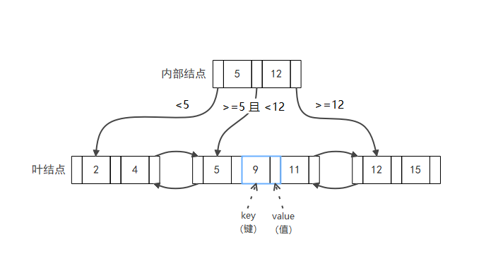
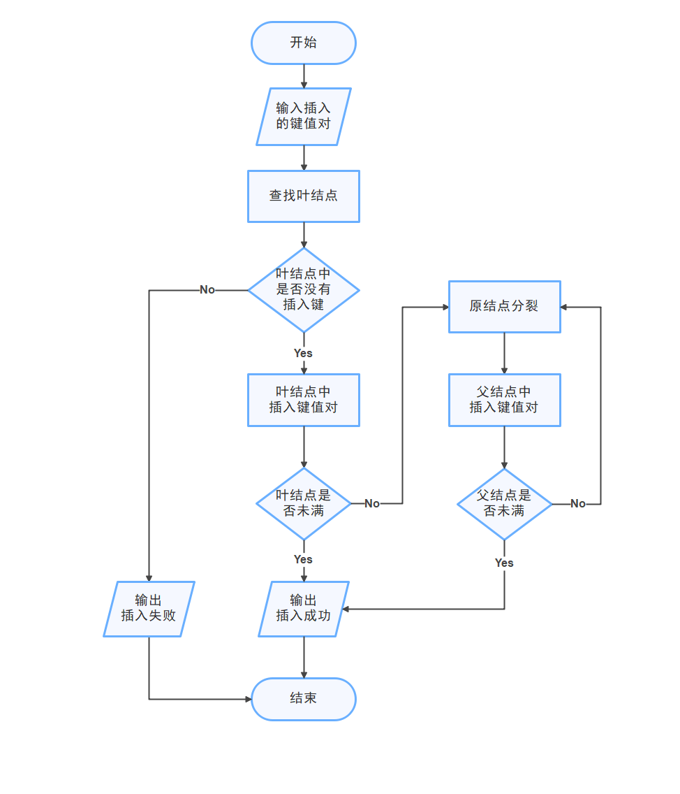
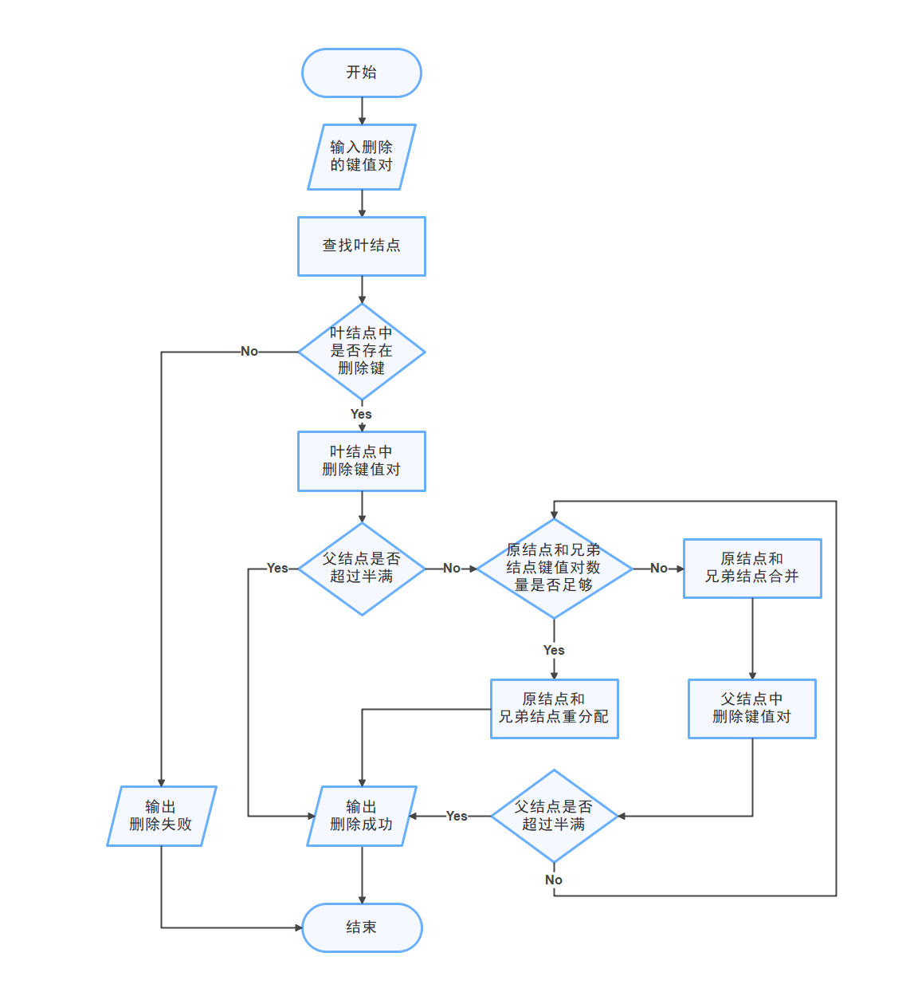

# Lab 2：索引管理

开始实验前，请先按照 [RUCBase 使用文档](RUCBase使用文档.md) 完成构建和测试环境配置。

在本实验中，学生需要完成 B+ 树索引的核心算法。开始编码前，可先阅读 [`src/index/README.md`](../src/index/README.md) 了解模块边界和页面布局。

| 文件 | 主要类型 | 职责 |
| --- | --- | --- |
| `index_types.h/.cpp` | `IndexFileHeader`、`IndexPageHeader`、`IndexPosition` | 定义磁盘布局和扫描位置 |
| `index_manager.h/.cpp` | `IndexManager` | 管理索引文件生命周期 |
| `b_plus_tree.h/.cpp` | `BPlusTree`、`BPlusTreeNode` | 实现 B+ 树算法 |
| `index_scan.h/.cpp` | `IndexScan` | 沿叶子链表遍历索引项 |

学生只需要实现 `BPlusTree` 和 `BPlusTreeNode` 中标有 `Todo` 的接口；`IndexManager`、`IndexScan` 和序列化代码均由框架提供。


B+树的结构如图：



注意：

（1）本系统设计的B+树索引不支持重复键，即唯一索引（索引列不包含重复的值）。

（2）结点能容纳的键值对数量小于最大值，大于等于最小值。这相当于留出了一个多余的空位，方便B+树进行插入和删除操作。

（3）在上图中，value的数量比key的数量多一个，而为了体现”键值对“的概念，实际上应该将key和value的数量设为相等。为了做到这一点，在每个内部结点的第一个值前面额外加上第一个键，这样就能让键和值的数量保持一致，即具有 k+1 个键的内部结点能索引 k+1 个子树。这个键（内部结点的第一个键）存储的key设置为其第一个孩子结点的第一个key，当结点分裂或合并时，可能需要更新其信息；同样地，在每个叶子结点的第一个值前面也额外加上第一个键，它存储当前结点中插入的最小key。（**每个结点的第一个key，存储的都是以该结点为根结点的子树中的所有key的最小值**）

**辅助函数说明**

本实验提供一些已经实现好的辅助函数，学生无需实现，可以阅读其实现，并调用其功能。

（1）`BPlusTreeNode`类的辅助函数：

```cpp
class BPlusTreeNode {
    // 辅助函数（本实验提供，无需实现）
    char *get_key(int key_idx) const;
    Rid *get_rid(int rid_idx) const;
}
```

- `char *get_key(int key_idx) const;`

​		得到键数组中指定位置的地址。

- `Rid *get_rid(int rid_idx) const;`

​		得到值数组中指定位置的地址。

（2）`BPlusTree`类辅助函数：

```cpp
class BPlusTree {
    // 辅助函数（本实验提供，无需实现）
    BPlusTreeNode *fetch_node(int page_no) const;
    BPlusTreeNode *create_node();
    void update_ancestor_keys(BPlusTreeNode *node);
    void update_child_parent(BPlusTreeNode *node, int child_idx);
    void unlink_leaf(BPlusTreeNode *leaf);
    void record_page_deletion();
}
```

- `BPlusTreeNode *fetch_node(int page_no) const;`

​		用于获取指定页面对应的`BPlusTreeNode`。

- `BPlusTreeNode *create_node();`

​		用于创建一个`BPlusTreeNode`。

- `void update_ancestor_keys(BPlusTreeNode *node);`

  用于从`node`开始更新其父节点的第一个key，一直向上更新直到根节点。

- `void update_child_parent(BPlusTreeNode *node, int child_idx);`

  用于将`node`的第`child_idx`个孩子结点的父结点指针置为`node`。

- `void unlink_leaf(BPlusTreeNode *leaf);`

  用于删除 `leaf` 之前，更新其前驱和后继叶子页指针。

- `void record_page_deletion();`

  用于删除`node`之后，更新索引头记录的页面个数信息。

（3）`int compare_index_key(const char *left, const char *right, ColType type, int column_length);`

​		用于比较两个定长键。`column_length` 是该列在复合键中占用的字节数。

### 任务1 B+树的查找

#### （1）结点内的查找

```cpp
class BPlusTreeNode {
    // 结点内的查找
    int lower_bound(const char *target) const;
    int upper_bound(const char *target) const;
    bool leaf_lookup(const char *key, Rid **value);
    page_id_t internal_lookup(const char *key);
}
```

为了实现整个B+树的查找，首先需要实现B+树单个结点内部的查找。

学生需要实现以下函数：

- `int lower_bound(const char *target) const;`

  用于在当前结点中查找第一个大于或等于`target`的key的位置。

- `int upper_bound(const char *target) const;`

  用于在当前结点中查找第一个大于`target`的key的位置。

提示：获得key需要调用`get_key()`函数；在比较key大小时需要调用`compare_index_key()`函数；B+树中每个结点的键数组是有序的，可用二分查找。

- `bool leaf_lookup(const char *key, Rid **value);`

​		用于叶子结点根据key来查找该结点中的键值对。值`value`作为传出参数，函数返回是否查找成功。

​		提示：可以调用`lower_bound()`和`get_rid()`函数。

- `page_id_t internal_lookup(const char *key);`

​		用于内部结点根据key来查找该key所在的孩子结点（子树）。

​		值value为Rid类型，对于内部结点，其Rid中的page_no表示指向的孩子结点的页面编号。而内部结点每个key右边的value指向的孩子结点中的键均大于等于该key，每个key左边的value指向的孩子结点中的键均小于该key。根据这一特性，思考如何找到key所在的孩子结点。

​		提示：可以调用`upper_bound()`和`get_rid()`函数。

#### （2）B+树的查找

```cpp
class BPlusTree {
    // B+树的查找
    std::pair<BPlusTreeNode *, bool> find_leaf_page(const char *key, IndexOperation operation, Transaction *transaction,bool find_first = false);
    bool get_value(const char *key, std::vector<Rid> *result, Transaction *transaction);
}
```

学生需要实现以下函数：

- `std::pair<BPlusTreeNode *, bool> find_leaf_page(const char *key, IndexOperation operation, Transaction *transaction, bool find_first = false);`

​		用于查找指定键所在的叶子结点。

​		从根结点开始，不断向下查找孩子结点，直到找到包含该key的叶子结点。

​		`operation`表示上层调用此函数时进行的是何种操作（因为查找/插入/删除均需要查找叶子结点）。

​		提示：可以调用`fetch_node()`和`internal_lookup()`函数。

- `bool get_value(const char *key, std::vector<Rid> *result, Transaction *transaction);`

  用于查找指定键在叶子结点中的对应的值`result`。

  提示：可以调用`find_leaf_page()`和`leaf_lookup()`函数。

### 任务2 B+树的插入

#### （1）结点内的插入

```cpp
class BPlusTreeNode {
    // 结点内的插入
    void insert_pairs(int pos, const char *key, const Rid *rid, int n);
    int insert(const char *key, const Rid &value);
}
```

学生需要实现以下函数：

- `void insert_pairs(int pos, const char *key, const Rid *rid, int n);`

​		用于在结点中的指定位置插入多个键值对。

​		该函数插入指定 `n` 个键值对数组 `(key, rid)` 到结点中的 `pos` 位置。`key` 指向连续的定长复合键，每个键占 `file_header_->key_length_` 字节；`rid` 指向与键一一对应的 `Rid` 数组。节点页内先连续存放键数组，再存放 `Rid` 数组。

​		对于该操作的内部实现逻辑，可以先将数组中原来从第`pos`位开始到其后`n`位的数据移到末尾，再将要插入的数组移到`pos`位之后。注意键数组和值数组的数据都要移动。

​		提示：需要调用`get_key()` / `get_rid()`函数得到 键/值 数组中指定位置的地址；可以调用`memcpy()`和`memmove()`进行数据移动。

- `int insert(const char *key, const Rid &value);`

​		用于在结点中插入单个键值对。函数返回插入后的键值对数量。

​		注意：重复的key不插入；插入后需要保持键数组仍然有序。

​		提示：可以调用`lower_bound()`和`insert_pairs()`函数。

#### （2）B+树的插入

```cpp
class BPlusTree {
    // B+树的插入
    page_id_t insert_entry(const char *key, const Rid &value, Transaction *transaction);
    BPlusTreeNode *split(BPlusTreeNode *node);
    void insert_into_parent(BPlusTreeNode *old_node, const char *key, BPlusTreeNode *new_node, Transaction *transaction);
}
```
学生需要实现以下函数：

- `page_id_t insert_entry(const char *key, const Rid &value, Transaction *transaction);`

​		用于将指定键值对插入到B+树。

​		首先找到要插入的叶结点，然后将键值对插入到该叶结点。如果该结点插入后已满，即size==max_size，就需要分裂成两个结点，分裂后还需要将新结点相关信息插入到父结点，不断向上递归插入直到当前结点在插入后未满或到达根结点。

​		提示：需要调用`find_leaf_page()`、`insert()`、`split()`、`insert_into_parent()`。

- `BPlusTreeNode *split(BPlusTreeNode *node);`

​		用于分裂结点。函数返回分裂产生的新结点。

​		具体做法是，将原结点的键值对平均分配，其左半部分不变，右半部分移动到分裂产生的新结点中。新结点在原结点的右边。

​		注意：如果分裂的结点是叶结点，要更新叶结点的后继指针。如果分裂的结点是内部结点，要更新其孩子结点的父指针。

- `void insert_into_parent(BPlusTreeNode *old_node, const char *key, BPlusTreeNode *new_node, Transaction *transaction);`

​		用于结点分裂后，更新父结点中的键值对。

​		将`new_node`的第一个key插入到父结点，其位置在 父结点指向`old_node`的孩子指针value 之后。如果父结点插入后size==maxsize，则必须继续分裂父结点，然后在该父结点的父结点再插入，即需要递归。不断地分裂和向上插入，直到父结点被插入后未满，或者一直向上插入到了根结点，才会停止递归；如果一直向上插入到了根结点，会产生一个新的根结点，它的左孩子是分裂前的原结点，右孩子是分裂后产生的新结点。

​		提示：需要调用`split()`和`insert_into_parent()`，进行递归。


B+树插入的整体流程如下图：




### 任务3 B+树的删除

#### （1）结点内的删除

```cpp
class BPlusTreeNode {
    // 结点内的删除
    void erase_pair(int pos);
    int remove(const char *key);
}
```

学生需要实现以下函数：

- `void erase_pair(int pos);`

  用于在结点中的指定位置删除单个键值对。

  提示：可以调用`memmove()`函数。

- `int remove(const char *key);`

​		用于在结点中删除指定key的键值对。函数返回删除后的键值对数量。

​		提示：可以调用`lower_bound()`和`erase_pair()`函数。

#### （2）B+树的删除

```cpp
class BPlusTree {
    // B+树的删除
    bool delete_entry(const char *key, Transaction *transaction);
    bool coalesce_or_redistribute(BPlusTreeNode *node, Transaction *transaction = nullptr,bool *root_is_latched = nullptr);
    bool coalesce(BPlusTreeNode **neighbor_node, BPlusTreeNode **node, BPlusTreeNode **parent, int index,Transaction *transaction, bool *root_is_latched);
    void redistribute(BPlusTreeNode *neighbor_node, BPlusTreeNode *node, BPlusTreeNode *parent, int index);
    bool adjust_root(BPlusTreeNode *old_root_node);
}
```

学生需要实现以下函数：

- `bool delete_entry(const char *key, Transaction *transaction);`

​		用于删除B+树中含有指定`key`的键值对。

​		首先找到要删除的叶结点，直接删除对应键值对。如果删除后该结点小于半满，则需要合并（Coalesce）或重分配（Redistribute）。

​		提示：需要调用`find_leaf_page()`、`remove()`、`coalesce_or_redistribute()`。

- `bool coalesce_or_redistribute(BPlusTreeNode *node, Transaction *transaction = nullptr,bool *root_is_latched = nullptr);`

  用于处理合并和重分配的逻辑。函数返回是否有结点被删除（无论是`node`还是它的兄弟结点被删除）。传出参数`root_is_latched`记录根结点是否被上锁，该参数将在任务3使用，在本任务2中不使用。

​		首先需要得到`node`的兄弟结点（尽量找前驱结点），然后根据键值对总和能否支撑两个结点决定是合并还是重分配。如果`node`是根结点，则需要特殊处理（AdjustRoot）。

​		提示：需要调用`coalesce()`、`redistribute()`、`adjust_root()`。

- `bool coalesce(BPlusTreeNode **neighbor_node, BPlusTreeNode **node, BPlusTreeNode **parent, int index,Transaction *transaction, bool *root_is_latched);`

​		将`node`向前合并到其前驱`neighbor_node`。函数返回`node`的父结点`parent`否需要被删除。

​		将`node`中的键值对全部移动到`neighbor_node`，移动时注意更新孩子结点的父指针。由于合并操作实质上删除了结点`node`，所以还要删除父结点中的对应键值对，然后继续递归，进入父结点进行合并或重分配。如果是叶结点被删除要更新其后继指针。

​		参数`index`是`node`在`parent`中的rid_idx，其表示`neighbor_node`是否为`node`的前驱结点。需要保证`neighbor_node`为`node`的前驱，如果不是，则交换位置。

​		提示：需要调用`insert_pairs()`、`erase_pair()`、`update_child_parent()`、`record_page_deletion()`。以及`coalesce_or_redistribute()`进行继续递归。

- `void redistribute(BPlusTreeNode *neighbor_node, BPlusTreeNode *node, BPlusTreeNode *parent, int index);`

​		重新分配`node`和兄弟结点`neighbor_node`的键值对。参数`index`表示`node`在parent中的rid_idx，其决定`neighbor_node`是否为`node`的前驱结点。

​		`node`是之前被删除过的结点，所以要移动其兄弟结点`neighbor_node`的一个键值对到`node`。注意这里有多种情况要考虑：根据`neighbor_node`是在`node`的前面还是后面，移动的键值对不一样；此外，如果`node`是内部结点要更新其孩子结点的父指针。

​		提示：需要调用`insert_pairs()`、`erase_pair()`、`update_child_parent()`。

- `bool adjust_root(BPlusTreeNode *old_root_node);`

​		用于根结点被删除了一个键值对之后的处理。函数返回根结点是否需要被删除。

​		考虑两种根结点需要被删除的情况：（1）删除了根结点的最后一个键值对，但它仍然有一个孩子。那么可以将其孩子作为新的根结点。（2）删除了整个B+树的最后一个键值对。那么直接更新文件头中记录的根结点为`INVALID_PAGE_ID`。

​		对于其他情况则无需任何处理，因为根结点无需被删除。

​		提示：需要调用`record_page_deletion()`。


B+树删除的整体流程如下图：



### 任务4 B+树索引并发控制

本任务要求修改`BPlusTree`类的原实现逻辑，让其支持对B+树索引的**并发**查找、插入、删除操作。

学生可以选择实现并发的粒度，选择下面两种并发粒度的任意一种进行实现即可。

##### 方法一、粗粒度并发（Tree级）

比较简单的粗粒度实现方法是对整个树加锁，即让查找、插入、删除三者操作互斥。

提醒：这种方法的实现类似于 实验一任务1.3 缓冲池管理器的并发实现。

##### 方法二、细粒度并发（Page级）【选做】

请自行学习B+树索引并发算法：**蟹行协议（crabbing protocol）**。

主要需要修改`BPlusTree`类中以下函数的实现逻辑：

（1）`find_leaf_page()`

​		此函数十分重要，在B+树的查找/插入/删除操作中均被调用。其基本功能在于根据指定`key`从根结点向下查找到含有该`key`的叶结点。

​		引入并发控制算法，以 **蟹行协议（crabbing protocol）** 为例，其使用读写锁来控制对树结点（索引页面）的访问和修改，并规定向下遍历树时 获取/释放 锁的机制：每个线程都是以自上而下的方式获取锁，从根结点开始获取锁，然后向下进入孩子结点并获取锁，再选择是否释放父结点的锁。

​		参数`operation`表示操作类型。对于查找操作，进入树的每一层结点都是先在当前结点获取读锁，然后释放父结点读锁；对于插入和删除操作，进入树的每一层结点都是先在当前结点获取写锁，如果当前结点“安全”才释放所有祖先节点的写锁。“安全”结点的定义是：结点插入一个键值对后仍然未满(size+1<max_size)；或者结点删除一个键值对后仍然超过或等于半满(size-1>=min_size)；注意，根结点的min_size=2，其余结点的min_size=max_size/2。

​		参数`transaction`表示事务，其中有一个数据结构`page_set_`用于存储从根结点到当前结点经过的所有祖先结点（索引页面）。实际上，只有插入或删除操作需要记录当前结点的所有祖先结点，然后判断如果当前结点是“安全”的，就遍历`transaction`的`page_set_`中存放的所有页面，依次释放这些页面的写锁。

​		函数返回值修改为`std::pair<BPlusTreeNode*, bool>`，其两部分分别表示找到的叶结点以及根结点是否被锁住。在`BPlusTree`类中设计了一个mutex锁（互斥锁）`root_latch_`用于对根结点进行上锁。对于读操作（查找），不需要对根结点上锁，因为蟹行协议允许多个线程同时读B+树；但对于写操作（插入/删除），则需要上锁，直到确定根结点不会被修改或者已经将根结点修改完毕，才能释放锁，从而防止本线程写操作未完成而其他线程又进行读的错误。最后用一个bool类型的变量表示根结点是否被上锁。

（2）查找函数`get_value()`

​		与之前实现不同的是，此处经过`find_leaf_page()`找到的叶结点被加上了读锁，且其祖先结点无任何读锁。最后释放叶结点的读锁即可。

（3）插入函数`insert_entry()`、`split()`、`insert_into_parent()`

删除函数`delete_entry()`、`coalesce_or_redistribute()`、`coalesce()`、`redistribute()`、`adjust_root()`

​		当要插入或删除某个键值对时，首先获取根结点的写锁， 在其孩子结点上获取写锁。然后判断孩子结点是否“安全”，只有孩子结点安全才能释放它的所有祖先结点的写锁。不断重复这一过程，直到找到叶结点，最后叶结点获取的是写锁。

​		注意释放结点写锁的时机：对于每一层结点，都是确定其安全之后，才能释放其上层的写锁。

### 实验计分

本实验满分为100分，测试文件对应的任务点及其分值如下：

| 任务点                         | 测试文件                                       | 分值 |
| ------------------------------ | --------------------------------------------  | ---- |
| 任务1和任务2  B+树的查找和插入 | src/test/index/b_plus_tree_insert_test.cpp      | 30   |
| 任务3 B+树的删除               | src/test/index/b_plus_tree_delete_test.cpp     | 40   |
| 任务4 B+树的并发控制           | src/test/index/b_plus_tree_concurrent_test.cpp  | 30   |

在仓库根目录编译并运行本实验的测试：

```bash
cmake --preset debug
cmake --build --preset debug -j 4
ctest --preset lab2
```

注意：
1. 在本实验中的所有测试只调用`get_value()`、`insert_entry()`、`delete_entry()`这三个函数。学生可以自行添加和修改辅助函数，但不能修改以上三个函数的声明。
2. 索引单元测试直接使用 `IndexManager` 创建测试索引，不要求提前实现 Lab3 的 `SmManager::create_index()`。
