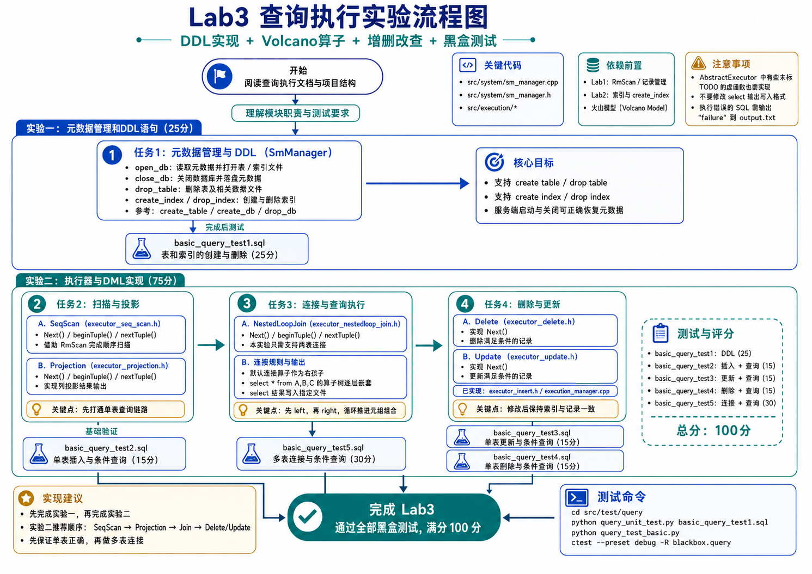

# Lab 3：查询执行

开始实验前，请先按照 [RUCBase 使用文档](RUCBase使用文档.md) 完成构建和测试环境配置，并阅读 [RUCBase 项目结构](RUCBase项目结构.md) 了解查询路径。

RUCBase 查询执行模块采用火山模型（Volcano Model）。可以通过[论文](https://www.computer.org/csdl/journal/tk/1994/01/k0120/13rRUwI5TRe)了解其基本概念。



## 实验一：元数据管理和DDL语句 (20分)

在本实验中，你需要完成src/system/sm_manager.cpp中的接口，使得系统能够支持DDL语句，具体包括create table、drop table、create index和drop index语句。

相关代码位于`src/system/sm_manager.h`和`src/system/sm_manager.cpp`文件中。在`src/system/sm_manager.cpp`文件中，给出了`create_table`、`create_db`和`drop_db`函数的实现示例，你需要参照这些函数实现剩余的空缺函数。

在`SmManager`类中，你需要实现的函数接口如下：
- `open_db(...)`：系统通过调用该接口打开数据库

在运行系统时，你需要在命令行中输入一个参数\<database name\>，代表当前数据库的名称，系统会创建一个同名文件夹，并在文件夹中存储所有数据库相关的数据文件。系统再次启动时，会打开数据库名称的同名文件夹，并通过读取元数据文件获取当前数据库的相关元数据。
同时，系统还需要打开所有的表文件和索引文件，并将文件句柄加载到系统中。

- `close_db(...)`：系统通过调用该接口关闭数据库

在系统服务端关闭时，系统调用该函数，将元数据信息、表数据等落盘，并关闭相关文件。

- `drop_table(...)`：删除表

系统调用该函数删除指定名称等表，并删除相关的数据文件，更新元数据信息

- `create_index(...)`：创建索引

系统调用该函数在指定表的指定属性上创建索引。`unique` 属于这条索引的定义：`CREATE INDEX` 为 false，`CREATE UNIQUE INDEX` 为 true。用 `IndexMeta::make(表, 列, unique)` 构造后交给 `IndexManager::create_index`，并把同一份定义写进表的元数据。删除或更新记录时，按 `(key, Rid)` 维护索引。

表中已有的记录也要写入新索引。如果声明了 `UNIQUE`，而已有数据中存在重复 key，建索引应当失败，并且不能留下任何痕迹：已创建的索引文件和句柄要清理掉，元数据保持不变。之后在同一列上仍然可以正常创建普通索引。

- `drop_index(...)`：删除索引

系统调用该函数删除指定表的指定索引。

### 测试点及分数

在完成本任务后，可以使用 `src/test/query/query_unit_test.py` 单独运行一个查询测试：

```bash
cd src/test/query
python3 query_unit_test.py basic_query_test1.sql # 20分
```

也可以在仓库根目录执行 `ctest --preset lab3-query`。


## 实验二：DML语句实现（60分）

在本实验中，你需要完成src/execution文件夹下执行算子中的空缺函数，使得系统能够支持增删改查四种DML语句。

相关代码位于`src/execution`文件夹下，其中需要完成的文件包括`executor_delete.h`、`executor_nestedloop_join.h`、`executor_projection.h`、`executor_seq_scan.h`、`executor_update.h`，已经实现的文件包括`executor_insert.h`和`execution_manager.cpp`。

在本实验中，你需要仿照insert算子实现如下算子：

- `SeqScan`算子：你需要实现该算子的`next()`、`begin_tuple()`和`next_tuple()`接口，用于表的扫描，你需要调用`RmScan`中的相关函数辅助实现（这些接口在lab1中已经实现）；
- `Projection`算子：你需要实现该算子的`next()`、`begin_tuple()`和`next_tuple()`接口，该算子用于投影操作的实现；
- `NestedLoopJoin`算子：你需要实现该算子的`next()`、`begin_tuple()`和`next_tuple()`接口，该算子用于连接操作，在本实验中，你只需要支持两表连接；
- `Delete`算子：你需要实现该算子的`next()`接口，该算子用于删除操作；
- `Update`算子：你需要实现该算子的`next()`接口，该算子用于更新操作。

所有算子都继承自抽象算子类 `AbstractExecutor`，基类声明了各执行器需要实现的统一接口。

**注意⚠️：**

**部分基类虚函数在子类中没有标记 `Todo`，但仍需根据接口契约完成，否则程序无法正确运行。** 例如 `is_end()`、`cols()`、`tuple_len()`：连接算子和排序算子会调用孩子的这些接口，连接算子自己也可能成为排序算子的孩子。

本实验不要求实现 `IndexScanExecutor`。优化器在建有索引的列上遇到等值条件时会选择索引扫描，因此本实验的测试不会在这类列上使用等值条件。

### 维护索引与唯一约束

`InsertExecutor` 是框架提供的参考实现：插入记录后逐个写入索引；如果某个唯一索引抛出 `DuplicateKeyError`，就撤销已写入的索引项和记录，再把异常抛给上层。`Delete` 和 `Update` 也要维护表上的全部索引：

- 删除记录时，按 `(key, Rid)` 删除它在每个索引中的那一项。普通索引中同一 key 可能对应多条记录，不能删错。
- 更新记录时，如果新值与某个唯一索引中已有的 key 冲突，需要抛出 `DuplicateKeyError`，并且**发生冲突的这一行**（记录本身以及它在所有索引中的项）必须保持原状。把一行的唯一键更新为它原来的值不算冲突。
- 本实验没有事务，一条 `UPDATE` 修改多行时如果中途冲突，已经修改的行是否回滚不作要求；测试只覆盖单行冲突。

如何检查冲突、按什么顺序修改记录和索引、失败后怎样恢复，由你自己设计。

### 连接算子实现提示

多表连接语句的语法如下：

```sql
select [col..] from TbName join TbName ... where cond;
```

连接算子不能够作为算子树的叶子节点，它的结构中有两个指向左右孩子算子的指针

```cpp
std::unique_ptr<AbstractExecutor> left_;
std::unique_ptr<AbstractExecutor> right_;
```

**在本系统中，默认规定用的连接方式是连接算子作为右孩子**

如，`select * from A,B,C`，系统生成的算子树如下

```cpp
//          P (Projection)
//          |
//          L2  (LoopJoin)
//         /  \
//        A    L1
//           /    \
//          B      C  (C table scan)
```

你需要补充完成`LoopJoin`算子中的以下3个方法：

```cpp
void begin_tuple() override {}

void next_tuple() override {}

std::unique_ptr<RmRecord> next() override{}

```

### 测试点及分数

完成本实验后，需要通过 `basic_query_test2`～`basic_query_test6`。其中 `basic_query_test6` 测试唯一索引：重复插入、更新冲突、在有重复数据的列上建唯一索引、复合唯一索引，以及冲突后表和索引是否保持一致。

```bash
cd src/test/query
python3 query_unit_test.py basic_query_test6.sql
```

测试失败时可在`build/debug/test-logs`中查看服务端和客户端日志。


## 实验三：排序归并连接（20分）

嵌套循环连接对左表的每条记录都要扫描一遍右表。对于等值连接，**排序归并连接（Sort-Merge Join）** 先把两侧输入分别按连接键排好序，再像归并两个有序数组一样同时向前推进两侧，每侧只读一遍。

### 如何启用

归并连接默认关闭。执行下面的语句后，优化器会对**含有列与列等值条件**的连接使用归并连接，其余连接仍然使用嵌套循环：

```sql
set enable_sortmerge = true;   -- 关闭：set enable_sortmerge = false;
```

该设置对整个服务端生效。启用后，优化器（框架代码，`Planner::choose_join_algorithm`）会：

1. 把第一个等值条件放到 `conds[0]`，作为归并键，其中 `lhs_col` 来自左孩子，`rhs_col` 来自右孩子；
2. 在左右孩子上各加一个按连接列升序排列的排序算子；
3. 其余连接条件保持原样，由归并连接算子在键相等后继续检查。

例如 `select * from A, B where A.id = B.id and A.x < B.y` 生成的算子树如下：

```cpp
//              P (Projection)
//              |
//              MJ (MergeJoin, conds = [A.id = B.id, A.x < B.y])
//            /    \
//      Sort(A.id)  Sort(B.id)
//          |          |
//          A          B
```

### 需要实现的算子

- `SortExecutor`（`execution_sort.h`）：读完孩子的全部输出，按单个字段升序或降序排好后依次返回。输出记录的字段布局与孩子相同。它也用于 `ORDER BY`。
- `MergeJoinExecutor`（`executor_merge_join.h`）：构造函数由框架给出，已经算好了输出字段、归并键在左右记录中的位置 `left_key_` / `right_key_`，以及附加条件 `residual_conds_`。你需要实现 `begin_tuple()`、`next_tuple()`、`next()`，以及基类中未标记 `Todo` 的 `is_end()`、`cols()`、`tuple_len()` 等接口。

需要思考的问题：

- 两侧都可能有连接键相同的一组记录，此时应输出这两组记录的笛卡尔积。火山模型的孩子算子只能向前迭代，无法“退回去”重读，该怎样处理？
- 某一侧先读完时，算子应当何时结束？
- 两个 `char(n)` 列比较时，长度可能不同，例如 `char(8)` 与 `char(16)`。怎样比较才能与嵌套循环连接的判等结果一致？

### 测试点及分数

- `lab3_sort_executor_test`、`lab3_merge_join_test`：直接用内存数据源测试算子。除了结果正确，还会检查两点：归并连接的输出按连接键有序；每个孩子只被扫描一遍，即 `begin_tuple()` 恰好调用一次。
- `basic_query_test7`：开启 `enable_sortmerge` 后的 SQL 测试，覆盖一对多、多对多、字符串和浮点连接键、三表连接、附加条件、空表等情况。

```bash
ctest --preset lab3 -R "sort_executor|merge_join"
cd src/test/query && python3 query_unit_test.py basic_query_test7.sql
```


## 测试说明

本实验满分 100 分，各测试点内容和分数如下：

| **测试点**     | **测试内容**      | **分数**      |
| ------------- | ----------------- | ------------- |
| `basic_query_test1` | 表和索引的创建与删除  | 20 |
| `basic_query_test2` | 单表插入与条件查询    | 10 |
| `basic_query_test3` | 单表更新与条件查询    | 10 |
| `basic_query_test4` | 单表删除与条件查询    | 10 |
| `basic_query_test5` | 多表连接与条件查询    | 20 |
| `basic_query_test6` | 唯一索引              | 10 |
| `lab3_sort_executor_test` | 排序算子        | 5  |
| `lab3_merge_join_test` | 归并连接算子       | 10 |
| `basic_query_test7` | 归并连接 SQL 测试     | 5  |

运行全部测试：

```bash
ctest --preset lab3
```

**注意：**

SQL 测试会比较查询结果的列名、类型和单元格取值；结果行按多重集比较，不要求行的顺序。客户端表格如何显示（列宽、小数位数等）不影响判分。测试失败时可在 `build/debug/test-logs` 查看服务端和客户端日志。
