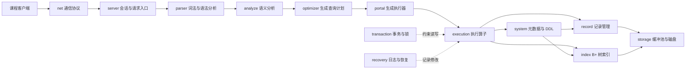

# RUCBase 项目结构

本文帮助初次阅读代码的同学建立整体认识。这里只介绍稳定的模块边界；具体实验接口以对应 Lab 文档和源码注释为准。

## 一次 SQL 请求如何执行

查询结果沿相反方向返回，由服务端通过 [RUCBase 通信协议](RUCBase通信协议.md) 发送给客户端。

## 主要目录

| 目录 | 职责 | 对应实验 |
| --- | --- | --- |
| `src/server/` | 启动服务、管理连接和请求上下文 | 综合入口 |
| `src/net/` | 客户端与服务端共用的通信协议 | 框架代码 |
| `src/parser/` | 把 SQL 文本解析成抽象语法树 | 框架代码 |
| `src/analyze/` | 检查表、字段和表达式，生成查询对象 | Lab 3 |
| `src/optimizer/` | 把查询对象转换成查询计划 | Lab 3 |
| `src/portal/` | 把计划转换成执行器并分发语句 | Lab 3 |
| `src/execution/` | 顺序扫描、投影、连接和增删改算子 | Lab 3 |
| `src/system/` | 数据库、表、索引的元数据和 DDL | Lab 3 |
| `src/record/` | 定长记录、页面和文件扫描 | Lab 1 |
| `src/index/` | B+ 树索引和索引扫描 | Lab 2 |
| `src/replacer/` | 缓冲池页面替换策略 | Lab 1 |
| `src/storage/` | 页面、缓冲池和磁盘文件访问 | Lab 1 |
| `src/transaction/` | 事务生命周期、锁和并发控制 | Lab 4 |
| `src/recovery/` | 日志管理与恢复框架 | 扩展内容 |
| `src/test/` | 单元测试和黑盒测试 | 全部实验 |
| `rucbase_client/` | 课程提供的交互式客户端 | 框架代码 |

## 数据如何落盘

启动 `rmdb <database_name>` 后，RUCBase 打开或创建同名数据库目录。目录中的核心内容包括：

- `db.meta`：数据库、表、字段和索引的 JSON 元数据；
- 表文件：由记录管理器按页组织定长记录；
- 索引文件：由索引管理器维护 B+ 树页面；
- `db.log`：日志管理器使用的日志文件。

表文件和索引文件不会绕过缓冲池直接被上层执行器操作。上层通过记录管理器或索引管理器访问页面，缓冲池负责页面的装入、固定、淘汰和刷盘，磁盘管理器负责最终的文件 I/O。

## 阅读代码的建议顺序

1. 从当前 Lab 文档确认任务边界；
2. 阅读相关模块的头文件，先理解公开接口和数据结构；
3. 沿调用方向查看相邻模块，不必一开始遍历整个仓库；
4. 结合对应测试理解输入、输出和边界条件；
5. 使用断点或少量日志跟踪一条最小请求。

四个实验逐层向上构建：Lab 1 提供存储基础，Lab 2 提供索引，Lab 3 把 SQL 转换为数据操作，Lab 4 为这些操作加入事务和并发约束。
