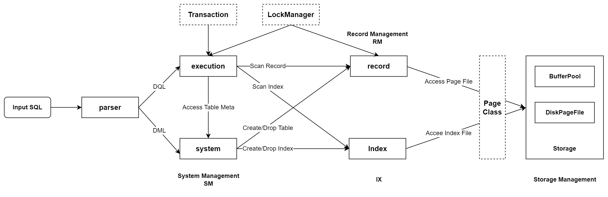

# Rucbase使用指南

<!-- START doctoc generated TOC please keep comment here to allow auto update -->

<!-- DON'T EDIT THIS SECTION, INSTEAD RE-RUN doctoc TO UPDATE -->

<!-- DON'T EDIT THIS SECTION, INSTEAD RE-RUN doctoc TO UPDATE -->

- [环境配置](#%E7%8E%AF%E5%A2%83%E9%85%8D%E7%BD%AE)
- [项目下载](#%E9%A1%B9%E7%9B%AE%E4%B8%8B%E8%BD%BD)
  - [GoogleTest子模块安装](#googletest%E5%AD%90%E6%A8%A1%E5%9D%97%E5%AE%89%E8%A3%85)
- [编译](#%E7%BC%96%E8%AF%91)
- [运行 (S/C)](#%E8%BF%90%E8%A1%8C-sc)
- [测试单元](#%E6%B5%8B%E8%AF%95%E5%8D%95%E5%85%83)
- [系统简介](#%E7%B3%BB%E7%BB%9F%E7%AE%80%E4%BB%8B)
  - [SQL Example](#sql-example)
- [基本结构](#%E5%9F%BA%E6%9C%AC%E7%BB%93%E6%9E%84)

<!-- END doctoc generated TOC please keep comment here to allow auto update -->

## 环境配置

Rucbase需要以下依赖环境库配置：

- gcc 7.1及以上版本（要求完全支持C++17）
- cmake 3.16及以上版本
- flex
- bison
- readline

可以通过命令完成环境配置(以Debian/Ubuntu-apt为例)

```bash
sudo apt-get install build-essential  # build-essential packages, including gcc, g++, make and so on
sudo apt-get install cmake            # cmake package
sudo apt-get install flex bison       # flex & bison packages
sudo apt-get install libreadline-dev  # readline package
```

可以通过`cmake --version`命令来查看cmake版本，如果低于3.16，需要在官网下载3.16以上的版本并解压，手动进行安装。

注意,在CentOS下,编译时可能存在头文件冲突的问题,我们不建议你使用Ubuntu以外的操作系统,你可以向助教获取帮助

## 项目下载

你可以通过以下两种方式来完成Rucbase及其子模块的下载

```bash
git clone --recursive https://github.com/ruc-deke/rucbase-lab.git
```

or

```bash
git clone https://github.com/ruc-deke/rucbase-lab.git
cd rucbase-lab
git submodule init
git submodule update //clone submodules
```

**注意，当新lab放出时，你需要先使用git pull命令拉取最新的实验文档**

### GoogleTest子模块安装

当本项目及子模块下载成功之后，你需要进行GoogleTest子模块的安装，具体命令如下：

```bash
cd deps
cd googletest
mkdir build
cd build
cmake ..
make
sudo make install
```

## 编译

整个系统分为服务端和客户端，你可以使用以下命令来进行服务端的编译：

```bash
mkdir build
cd build 
cmake .. [-DCMAKE_BUILD_TYPE=Debug]|[-DCMAKE_BUILD_TYPE=Release]
make rucbase <-j4>|<-j8> # 选择4 or 8线程编译，如果你不想选择，那么make -j也是可以的
```

可以使用以下命令来进行客户端的编译：

```bash
cd rucbase_client
mkdir build
cd build
cmake .. [-DCMAKE_BUILD_TYPE=Debug]|[-DCMAKE_BUILD_TYPE=Release]
make <-j4>|<-j8> # 选择4 or 8线程编译 
```

## 运行 (S/C)

首先运行服务端：

```bash
cd build
./bin/rucbase <database_name> # 如果存在该数据库,直接加载;若不存在该数据库,自动创建
```

然后开启客户端，用户可以同时开启多个客户端：

```bash
cd rucbase_client/build
./rucbase_client
```

用户可以通过在客户端界面使用exit命令来进行客户端的关闭：

```bash
Rucbase> exit;
```

服务端的关闭需要在服务端运行界面使用ctrl+c来进行关闭，关闭服务端时，系统会把数据页刷新到磁盘中。

+ 如果需要删除数据库，则需要在build文件夹下删除与数据库同名的目录
+ 如果需要删除某个数据库中的表文件，则需要在build文件夹下找到数据库同名目录，进入该目录，然后删除表文件

## 测试单元

GoogleTest框架测试

包含以下模块测试：

- 存储模块：

  - disk_manager_test
  
  - lru_replacer_test
  
  - clock_replacer_test (选做)
  
  - buffer_pool_manager_test
  
  - rm_gtest

- 索引模块：
  
  - b_plus_tree_insert_test
  - b_plus_tree_delete_test
  - b_plus_tree_concurrent_test

- 执行模块：
  
  - task1_test.sh
  - task2_test.sh
  - task3_test.sh
  - taskall_test.sh

- 事务模块：
  
  - txn_test
  - lock_test
  - concurrency_test

以lru_replacer_test为例，可以通过以下命令进行测试：

```bash
cd build
make lru_replacer_test
./bin/lru_replacer_test
```

## 系统简介

### SQL Example

目前系统支持基础DML和DDL语句，包括以下语句：

- create/drop table;
- create/drop index;
- insert;
- delete;
- update;
- begin;
- commit/abort;

目前事务的并发控制暂时支持可重复读隔离级别，事务暂时只支持基础insert、delete、update和select操作。

以下为SQL操作demo，具体下SQL语法可以在系统中使用help语句查询：

```sql
create table student (id int, name char(32), major char(32));
create index student (id);
create table grade (course char(32), student_id int, score float);
create index grade (student_id);

show tables;
desc student;

begin;
insert into student values (1, 'Tom', 'Computer Science');
insert into student values (2, 'Jerry', 'Computer Science');
insert into student values (3, 'Jack', 'Electrical Engineering');
commit;

begin;
select * from student where id>=1;
update student set major = 'Electrical Engineering' where id = 2;
select * from student where id>=1;
delete from student where name = 'Jack';
select * from student where id>=1;
commit;

begin;
insert into grade values ('Data Structure', 1, 90.0);
insert into grade values ('Data Structure', 2, 95.0);
insert into grade values ('Calculus', 2, 82.0);
insert into grade values ('Calculus', 1, 88.5);
abort;

begin;
insert into grade values ('Data Structure', 1, 90.0);
insert into grade values ('Data Structure', 2, 95.0);
insert into grade values ('Calculus', 2, 82.0);
insert into grade values ('Calculus', 1, 88.5);
commit;

select * from student, grade;
select id, name, major, course, score from student, grade where student.id = grade.student_id;
select id, name, major, course, score from student join grade where student.id = grade.student_id;

drop index student (id);
desc student;

drop table student;
drop table grade;
show tables;

exit;
```

## 基本结构

+ rucbase_client: 客户端源代码，无需修改

+ src: 服务端源代码
  
  + Parser: 将原始SQL语句转换为抽象语法树AST, 由ExecutionManager进一步解释和执行。
  
  + storage: 存储层, 由自己实现的BufferPoolManager和*unix提供接口的磁盘文件系统组成, 暴露给上层的单位为Page
  
  + replacer: 缓冲区替换算法
  
  + record : 管理存储了无序记录的Page, 对Page进行Tuple级操作
  
  + index : 管理存储在记录文件中的无序数据记录的持久索引
  
  + system : 处理DDL语句, 负责跟踪 创建/删除 表/索引
  
  + execution : 执行模块, 负责DML语句 查询计划树的生成与执行
  
  + transaction : 事务模块，提供事务的Begin/Commit/Abort接口, LockManager提供事务相关的锁
  
  + recovery : 日志模块，WAL算法，负责日志管理和系统恢复，目前只支持DML语句恢复


