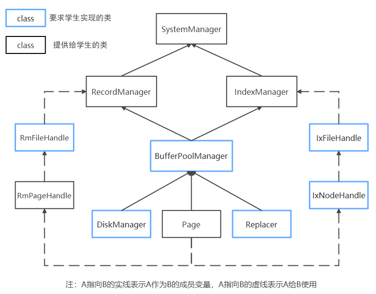
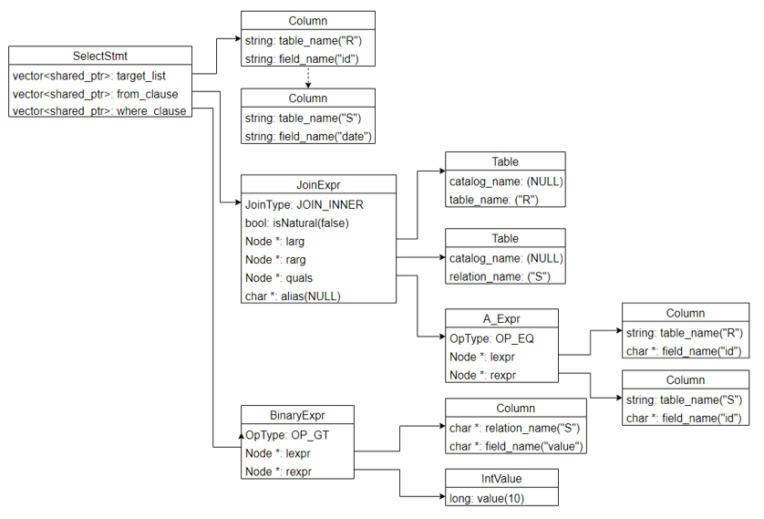

# Rucbase项目结构详解

<!-- START doctoc generated TOC please keep comment here to allow auto update -->
<!-- DON'T EDIT THIS SECTION, INSTEAD RE-RUN doctoc TO UPDATE -->

- [存储管理(Storage Management)](#%E5%AD%98%E5%82%A8%E7%AE%A1%E7%90%86storage-management)
  - [相关知识点](#%E7%9B%B8%E5%85%B3%E7%9F%A5%E8%AF%86%E7%82%B9)
  - [项目结构](#%E9%A1%B9%E7%9B%AE%E7%BB%93%E6%9E%84)
    - [文件存储组织模块：src/storage](#%E6%96%87%E4%BB%B6%E5%AD%98%E5%82%A8%E7%BB%84%E7%BB%87%E6%A8%A1%E5%9D%97srcstorage)
      - [Page](#page)
      - [DiskManager](#diskmanager)
      - [BufferPoolManager](#bufferpoolmanager)
    - [缓冲区管理：src/replacer](#%E7%BC%93%E5%86%B2%E5%8C%BA%E7%AE%A1%E7%90%86srcreplacer)
    - [记录存储组织模块：src/record](#%E8%AE%B0%E5%BD%95%E5%AD%98%E5%82%A8%E7%BB%84%E7%BB%87%E6%A8%A1%E5%9D%97srcrecord)
    - [元数据存储组织：src/system](#%E5%85%83%E6%95%B0%E6%8D%AE%E5%AD%98%E5%82%A8%E7%BB%84%E7%BB%87srcsystem)
- [索引(Index)](#%E7%B4%A2%E5%BC%95index)
  - [相关知识点](#%E7%9B%B8%E5%85%B3%E7%9F%A5%E8%AF%86%E7%82%B9-1)
  - [项目结构](#%E9%A1%B9%E7%9B%AE%E7%BB%93%E6%9E%84-1)
- [并发控制(Concurrency control)](#%E5%B9%B6%E5%8F%91%E6%8E%A7%E5%88%B6concurrency-control)
  - [相关知识点](#%E7%9B%B8%E5%85%B3%E7%9F%A5%E8%AF%86%E7%82%B9-2)
  - [项目结构](#%E9%A1%B9%E7%9B%AE%E7%BB%93%E6%9E%84-2)
- [故障恢复(Failure recovery)](#%E6%95%85%E9%9A%9C%E6%81%A2%E5%A4%8Dfailure-recovery)
  - [相关知识点](#%E7%9B%B8%E5%85%B3%E7%9F%A5%E8%AF%86%E7%82%B9-3)
  - [项目结构](#%E9%A1%B9%E7%9B%AE%E7%BB%93%E6%9E%84-3)
- [查询处理与执行(Query processing and execution)](#%E6%9F%A5%E8%AF%A2%E5%A4%84%E7%90%86%E4%B8%8E%E6%89%A7%E8%A1%8Cquery-processing-and-execution)
  - [相关知识点](#%E7%9B%B8%E5%85%B3%E7%9F%A5%E8%AF%86%E7%82%B9-4)
  - [项目结构](#%E9%A1%B9%E7%9B%AE%E7%BB%93%E6%9E%84-4)
- [语法解析](#%E8%AF%AD%E6%B3%95%E8%A7%A3%E6%9E%90)
  - [语法树结构](#%E8%AF%AD%E6%B3%95%E6%A0%91%E7%BB%93%E6%9E%84)
- [错误与异常处理](#%E9%94%99%E8%AF%AF%E4%B8%8E%E5%BC%82%E5%B8%B8%E5%A4%84%E7%90%86)

<!-- END doctoc generated TOC please keep comment here to allow auto update -->


## 存储管理(Storage Management)

### 相关知识点

- 数据库存储基本原理：数据库存储模型、存储介质和磁盘管理
- 文件存储组织：堆文件、顺序文件、聚簇文件、B+树文件、Hash文件
- 元数据存储组织：数据字典；数据字典的组织与存储
- 记录存储组织：定长记录组织，变长记录组织，记录不跨块存储，记录跨块存储
- 缓冲区管理：缓冲区组织方式，缓冲区管理策略

### 项目结构

存储管理模块相关的子目录为src/record、src/replacer、src/storage和src/system，分别对应记录存储组织、缓冲区管理、文件存储管理和元数据存储组织。存储管理模块是底层模块，主要为上层模块提供接口。

其中各个类之间的关系如下图所示：



在Rucbase系统中，每一个数据库对应一个同名文件夹，该数据库中的所有数据都以文件的形式存储在该文件夹中。每一个数据库包含一个`<database>.meta`文件和`<database>.log`文件，`<database>.meta`文件用来存储数据库的元数据，包括表的名称、表的元数据等信息；`<database>.log`文件用来存储日志信息。

Rucbase系统使用关系模型来进行存储，数据库中的表`<table>`包含了若干条记录`<record>`，这些记录都顺序存储在该表的同名文件中，并且以数据页(Page)的形式来对所有记录分块，进而通过对数据页的管理来统一管理表中的数据。

以下对各个子模块进行详细介绍：

#### 文件存储组织模块：src/storage

Rucbase系统以数据页(Page)为单位对内存中的数据来进行统一管理。系统提供了Page类(Page class)，通过BufferPoolManager来管理数据页在磁盘和内存中的I/O，通过DiskManager来进行磁盘中文件的读写。

##### Page

Page类是数据管理的基本单位，每一个Page都对应唯一的页号(PageId)，每一个数据页都对应一个磁盘文件，对于同一个文件中的数据页，用page_no来对数据页进行索引。

```c++
struct PageId {
    int fd;  //  Page所在的磁盘文件开启后的文件描述符, 来定位打开的文件在内存中的位置
    page_id_t page_no = INVALID_PAGE_ID;  // 该数据页位于所在文件的第几个数据页
};
```

每一个Page对象中存储了该数据页的相关信息以及该数据页存储的数据，可以分为页头(header)和数据区(data)，页头存放有关页面内容的元数据；数据区是存放页面实际数据的区域，它可以用于存放表中的记录。由于页面既可以用于存储记录，也可以用于存储索引，所以页头和数据区这两部分的实际内容其实是由记录的组织结构或索引的组织结构决定的。为了区分这两者，对于记录页，定义为由记录头（record page header）和数据区组成，对于索引页，定义为由索引头（index page header）和数据区组成。
目前本系统将页面大小（PAGE_SIZE）设计为固定的4KB大小，页面的数据结构如下：

```c++
class Page {
   public:
    Page() { ResetMemory(); }

   private:
    void ResetMemory() { memset(data_, OFFSET_PAGE_START, PAGE_SIZE); }  // 将data_的PAGE_SIZE个字节填充为0

    PageId id_;     /** page的唯一标识符 */

    char data_[PAGE_SIZE] = {};     // 该数据页存储的数据

    bool is_dirty_ = false;         // 该数据页是否为脏页，如果是脏页，系统需要根据缓冲池管理策略在合适的时间将页面数据写入磁盘

    int pin_count_ = 0;             // 用于记录正在使用该页面的线程个数

    ReaderWriterLatch rwlatch_;     // 该数据页的latch，用来保证数据页的并发操作正确性。
    /*
    ReaderWriterLatch分为读锁和写锁，每个线程在读写页面之前需要申请对应的锁，操作完成后释放对应的锁。如果在一个线程中获取了页面的写锁，那么其他线程无法读取和写入该页面，直到其释放写锁；如果在一个线程中获取了页面的读锁，那么其他线程无法写入该页面（可以读取），直到其释放读锁。
    */

};
```

在这些数据结构中，只有data是在内存和磁盘中进行交换，其内容就是之前提到的页头和数据区。

其他的数据结构只在内存中使用，并不会写入磁盘。

##### DiskManager

DiskManager负责磁盘文件的操作，为上层模块提供了操作文件、读写页面的功能。其数据结构如下：

```c++
class DiskManager {
   private:
    std::unordered_map<std::string, int> path2fd_;  // <Page文件磁盘路径,Page fd>哈希表
    std::unordered_map<int, std::string> fd2path_;  // <Page fd,Page文件磁盘路径>哈希表
    int log_fd_ = -1;                               // 日志文件的句柄
    std::atomic<page_id_t> fd2pageno_[MAX_FD]{};    // 在文件fd中分配的page no个数
};
```

##### BufferPoolManager

BufferPoolManager对内存中的缓冲池进行管理，内存中的缓冲池由若干个帧(frame)组成，缓冲池中每一个帧可以存放一个数据页，没有存放数据页的帧叫做空闲帧。系统对缓冲池中所有数据页的修改都暂时保存在内存中，只有当缓冲池中的数据页被替换时，才会把这些修改的数据刷新到磁盘中。缓冲池数据结构如下：

```c++
class BufferPoolManager {
   private:
    size_t pool_size_;  // 缓冲池中帧的数目，也就是最多能够同时容纳的数据页的个数

    Page *pages_;       // 连续存放的页面数组，在构造函数中进行初始空间申请

    std::unordered_map<PageId, frame_id_t, PageIdHash> page_table_; // 页表，记录数据页和帧的映射关系，如果数据页存放在某一帧中，则在页表中存放该数据页ID和对应帧号的映射关系，用于标记数据页在缓冲池中的存放位置

    std::list<frame_id_t> free_list_; // 缓冲池中未使用的空闲帧的帧号列表

    LRUReplacer *replacer_; // 用于提供缓冲池的页面替换算法。当空闲帧列表为空时，表示所有的帧都被页面占用了，这时如果要把一个新的数据页放入缓冲池中，就必须淘汰一个旧页面，使用替换算法器可以选择一个能被淘汰的页面。

    std::mutex latch_;  // 用于缓冲池的并发控制
};
```

#### 缓冲区管理：src/replacer

缓冲区管理模块主要提供了缓冲池页面的管理策略，目前本系统使用LRU(Least Recently Used)管理策略，即最近最少使用页面置换算法，当缓冲池需要淘汰一个页面时，选择最近最久未使用的页面进行淘汰，提供以下数据结构：

```c++
class LRUReplacer {
  private:
    std::mutex latch_;               // 互斥锁，用于并发控制

    std::list<frame_id_t> LRUlist_;  // 维护不被固定的帧列表，不被固定的帧存放的页面是可以被淘汰的，该列表按照帧被取消固定的时间戳顺序存放

    std::unordered_map<frame_id_t, std::list<frame_id_t>::iterator> LRUhash_;  // 维护帧号和LRUlist_中对象的映射关系

    size_t max_size_;  // 最大容量（与缓冲池的容量相同）
};
```

#### 记录存储组织模块：src/record

记录存储组织模块为上层模块提供了对表中记录的操作接口，包括记录文件的创建和删除、记录的插入修改和删除、记录文件中数据页的读写等。

首先介绍记录文件相关的数据结构，每一个数据库中的表可以分为表的元数据和表的记录数据，表的元数据统一存储在`<database.meta>`文件中，表的记录数据单独存储在同名文件中，我们称该文件为记录文件，在Rucbase系统中，我们用RmFileHandle类来对一个记录文件进行管理，RmFileHandle类中记录了文件描述符和文件头信息，数据结构如下：

```c++
class RmFileHandle { 
   private:
    int fd_;      // 文件描述符，操作系统打开磁盘文件后的一个编号，用于唯一地标识打开的文件

    RmFileHdr file_hdr_;  // 文件头信息
};
```

文件头信息用RmFileHdr结构体来进行维护。前文中提到，记录文件中顺序存放该表的每一条记录，按照数据页的形式进行划分，在目前系统中，同一个表中的所有记录大小是相同的，因此，在一个表创建之初，该表的record_size就固定下来了；对于数据页的管理，本系统目前使用Bitmap的形式进行管理，因此，在RmFileHdr中还记录了bitmap的大小，对于每一个数据页，都使用一个Bitmap来对该数据页的记录进行管理，因此Bitmap的大小在表创建之初就可以计算出来。RmFileHdr的数据结构如下：

```c++
struct RmFileHdr {
    int record_size;  // 元组大小（长度不固定，由上层进行初始化）
    // std::atomic<page_id_t> num_pages;
    int num_pages;             // 文件中当前分配的page个数（初始化为1）
    int num_records_per_page;  // 每个page最多能存储的元组个数
    int first_free_page_no;    // 文件中当前第一个可用的page no（初始化为-1）
    int bitmap_size;           // bitmap大小
};
```

file_hdr中的num_pages记录此文件分配的page个数，page_no范围为[0,file_hdr.num_pages)，page_no从0开始增加，其中第0页存file_hdr，从第1页开始存放真正的记录数据。

对于每一个数据页，本系统使用RmPageHandle类进行封装管理，每一个数据页的开始部分并不直接存放记录数据，而是按照以下顺序进行存放：

| page_lsn_ | page_hdr | bitmap | slots |

- page_lsn_用于故障恢复模块，将在故障恢复模块中进行详细介绍。

- page_hdr记录了两个信息，一个是num_records，记录当前数据页中已经分配的record个数，同时记录了next_free_page_no，记录了如果当前数据页写满之后，下一个还有空闲空间的数据页的page_no。

- bitmap记录了当前数据页记录的分配情况。

- slots则是真正的记录数据存放空间。

RmPageHandle的数据结构如下：

```c++
struct RmPageHandle {
    const RmFileHdr *file_hdr;  // 用到了file_hdr的bitmap_size, record_size
    Page *page;                 // 指向单个page
    RmPageHdr *page_hdr;        // page->data的第一部分，指针指向首地址，长度为sizeof(RmPageHdr)
    char *bitmap;               // page->data的第二部分，指针指向首地址，长度为file_hdr->bitmap_size
    char *slots;  // page->data的第三部分，指针指向首地址，每个slot的长度为file_hdr->record_size
};
```

对于具体的每一个记录，使用RmRecord来进行管理，数据结构如下：

```c++
struct RmRecord {
    char *data;  // data初始化分配size个字节的空间
    int size;    // size = RmFileHdr的record_size
};
```

同时，使用Rid来对每一个记录进行唯一的标识，数据结构如下：

```c++
struct Rid {
    int page_no;  // 该记录所在的数据页的page_no
    int slot_no;  // 该记录所在数据页中的具体slot_no
};
```

#### 元数据存储组织：src/system

system模块主要负责元数据管理和DDL语句操作执行，在存储模块主要涉及到了元数据管理，因此只对元数据存储相关的数据结构进行介绍，其余功能在查询模块进行介绍。

元数据存储相关的数据结构主要在sm_meta.h文件中，首先，对于一个数据库，使用DbMeta类来进行数据库元数据管理，数据结构如下：

```c++
class DbMeta {
   private:
    std::string name_;
    std::map<std::string, TabMeta> tabs_;
};
```

主要包含数据库的名称，以及数据库终所有表的元数据，这些数据都在close_db()的时候被写入到`<database.meta>`文件中，并且在open_db()时读取到内存中。

表的元数据主要通过TabMeta数据结构来进行管理：

```c++
struct TabMeta {
    std::string name;           // 表名称
    std::vector<ColMeta> cols;  // 表包含字段的元数据
};
```

对于每一个字段，通过ColMeta数据结构来进行管理：

```c++
struct ColMeta {
    std::string tab_name; // 表名称
    std::string name;     // 字段名称
    ColType type;         // 字段类型
    int len;              // 字段长度
    int offset;           // 字段所在记录中的偏移量，用于查询字段的具体存储位置
    bool index;           // 该字段是否为索引
};
```

## 索引(Index)

### 相关知识点

- 顺序索引：稠密索引及其查找算法，稀疏索引及其查找算法，多级索引及其查找算法，辅助索引
- B+树索引：B+树索引结构，索引查找，索引维护
- 哈希索引：基本Hash索引，可扩展Hash索引，线性Hash索引
- Bitmap索引：Bitmap索引结构，Bitmap索引查找，编码Bitmap索引
- LSM树：LSM树索引结构，LSM树维护，LSM树查找

### 项目结构

索引模块相关的子目录为src/index，主要实现了B+树，用来支持索引功能。

在本系统中，B+树以文件的方式存储在磁盘中，B+树的每个节点存储在一个磁盘块中，每个结点存储若干个键值对，在本系统中，如果想要把一个元组插入B+树，那么该元组会被解析成一个键值对`<key, value>`，其中key存储该元组中索引所在列的数据，value代表该元组的rid。

我们使用`IxFileHdr`来管理B+树文件的元数据，其中num_pages用来记录文件中的磁盘块数，root_page用来存储B+树根节点对应的磁盘块号，first_free_page_no代表文件中第一个空闲的磁盘页面的页面号，col_type和col_len分别记录当前索引所在列的数据类型和数据长度，btree_order存储一个B+树结点所能存储的最多的键值对数量。在每个结点对应的磁盘块中，磁盘块首部存储所有的元信息，然后存储所有的key，磁盘块的末尾部分用来存储所有的value，因此，需要用keys_size用来记录当前结点中所有key数据的大小，以便确定value部分的首地址。first_leaf和last_leaf分别存储首叶结点对应的磁盘块号和尾叶结点对应的磁盘块号。

```C++
struct IxFileHdr {
    page_id_t first_free_page_no;
    int num_pages;        // disk pages
    page_id_t root_page;  // root page no
    ColType col_type;
    int col_len;      // ColMeta->len
    int btree_order;  // children per page 每个结点最多可插入的键值对数量
    int keys_size;  // keys_size = (btree_order + 1) * col_len
    // first_leaf初始化之后没有进行修改，只不过是在测试文件中遍历叶子结点的时候用了
    page_id_t first_leaf;  // 在上层IxManager的open函数进行初始化，初始化为root page_no
    page_id_t last_leaf;
};
```

系统使用`IxPageHdr`来管理每个磁盘块（在内存中叫页面）的元数据，其中next_free_page_no代表当前B+树中，下一个空闲的未使用的磁盘块的块号，parent记录父结点所在磁盘块的块号，num_key代表当前节点中已经插入的键值对的数量，is_leaf用来判断当前结点是否为叶子结点，如果当前结点是叶子结点，那么prev_leaf存储当前结点的前一个叶子节点，next_leaf记录当前结点的下一个叶子结点。

```C++
struct IxPageHdr {
    page_id_t next_free_page_no;
    page_id_t parent;  // its parent's page_no
    int num_key;  // # current keys (always equals to #child - 1) 已插入的keys数量，key_idx∈[0,num_key)
    bool is_leaf;
    page_id_t prev_leaf;  // previous leaf node's page_no, effective only when is_leaf is true
    page_id_t next_leaf;  // next leaf node's page_no, effective only when is_leaf is true
};
```

系统在其他模块如存储模块、执行模块中，使用`Rid`来存储记录号，在索引模块中使用`Iid`来存储记录号，二者是等价的，一一对应的。

系统中，`IxNodeHandle`和`IxIndexHandle`分别提供了对B+树结点的操作方法和对B+树的操作方法。`IxManager`类为上层模块提供了创建索引、删除索引、把索引文件读取到内存中、关闭索引文件等接口。`IxScan`类提供了遍历B+树叶子结点的功能。

## 并发控制(Concurrency control)

### 相关知识点

- 两阶段封锁协议：协议内容；两阶段封锁协议存在的问题；死锁与级联回滚；死锁预防策略；严格两阶段封锁协议
- 基于时间戳的并发控制：基本的时间戳并发控制算法；如何确定等价的事务冲突可串行化顺序；冲突检测与事务回滚；基本的时间戳并发控制算法实现举例
- 乐观并发控制：基本的乐观并发控制算法；如何确定等价的事务冲突可串行化顺序；冲突检测与事务回滚；基本的乐观并发控制算法实现举例
- 多版本并发控制：并发控制协议；版本管理；垃圾回收；索引管理；删除；多版本并发控制实现举例

### 项目结构

并发控制模块相关代码子目录为src/transaction，主要包含事务管理器与锁管理器，提供事务管理方法和并发控制算法。其中src/transaction/concurrency文件夹中提供事务的并发控制算法。

本系统通过Transaction对象来维护事务上下文信息，数据结构如下：

```c++
class Transaction{
  private:
    TransactionState state_;          // 事务状态
    IsolationLevel isolation_level_;  // 事务隔离级别
    std::thread::id thread_id_;       // 创建本事务的对应线程ID
    txn_id_t txn_id_;                 // 事务ID，事务的唯一标识
    timestamp_t start_ts_;            // 事务开始时间戳
    std::shared_ptr<std::deque<WriteRecord *>> write_set_;      // 记录事务执行的写操作，用于事务回滚时撤销事务的操作
    lsn_t prev_lsn_;                  // 事务最新一条操作对应的日志记录号
    std::shared_ptr<std::unordered_set<LockDataId>> lock_set_;  // 事务申请的锁集
};
```

事务管理器TransactionManager类提供了事务的开始、提交和终止方法，并维护全局事务表txn_map，记录事务ID和事务对象指针的映射。数据结构如下：

```c++
class TransactionManager{
  private:
    ConcurrencyMode concurrency_mode_;            // 指定事务的并发控制算法，默认为两阶段封锁
    std::atomic<txn_id_t> next_txn_id_{0};        // 事务ID的逻辑计数器
    std::atomic<timestamp_t> next_timestamp_{0};  // 事务时间戳的逻辑计数器
    static std::unordered_map<txn_id_t, Transaction *> txn_map; // 全局事务表
};
```

锁管理器LockManager提供了行级锁、表级锁和表级意向锁，使用LockDataId来对加锁对象进行唯一标识：

```c++
class LockDataId {
  public:
    int fd_;            // 数据项所在表对应的文件句柄
    Rid rid_;           // 如果加锁对象是元组，rid_记录该元组的Rid
    LockDataType type_; // 记录加锁对象是元组还是表
};
```

同时，锁管理器提供了加锁和解锁方法，维护了全局锁表，使用LockRequest类来代表一个锁，用LockRequest类来维护加在数据项上的锁队列，用一个全局映射lock_table_来维护全局的锁表：

```c++
class LockManager {
  private:
    std::mutex latch_;  // 用于保证LockManager并发操作的正确性
    std::unordered_map<LockDataId, LockRequestQueue> lock_table_; // 全局锁表
};
```

全局锁表的结构如下：


LockRequestQueue类中，组模式GroupLockMode记录了当前锁队列中，已经授予的最严格的锁，用于在申请一个新锁时判断是否冲突；升级标志upgrading_记录了当前锁队列中是否有锁正在等待升级，一个队列中不能同时存在两个锁等待升级，会发生死锁；锁列表request_queue_维护了当前加在数据项上的锁的队列，包括已经被授予的锁和正在等待授予的锁。用一个条件变量（std::condition_variable）来维护锁队列的并发。


## 故障恢复(Failure recovery)

### 相关知识点

- 基于REDO日志的恢复算法：基于REDO日志的恢复算法；算法的优缺点分析
- 基于UNDO日志的恢复算法：基于UNDO日志的恢复算法；算法的优缺点分析
- 基于REDO/UNDO日志的恢复算法：基于REDO/UNDO日志的恢复算法；算法的优缺点分析
- 恢复算法ARIES：LSN；日志结构；日志缓冲区管理；ARIES算法

### 项目结构

故障恢复模块相关代码子目录为src/recovery，主要包含日志管理器和故障恢复管理器。

日志记录使用LogRecord对象来进行存储，LogRecord分为日志头和日志数据项，日志头记录每一条日志都需要记录的固定信息，包括以下内容：

```c++
class LogRecord {
  private:
    int32_t size_{0};                   // 本条日志记录的大小
    lsn_t lsn_{INVALID_LSN};            // 日志记录号，日志记录的唯一标识
    txn_id_t txn_id_{INVALID_TXN_ID};   // 创建当前日志记录的事务ID
    lsn_t prev_lsn_{INVALID_LSN};       // 事务创建的上一个日志记录的序列号
    LogRecordType log_type_{LogRecordType::INVALID};  // 日志记录对应操作的类型
};
```

根据日志记录对应操作的类型，需要记录不同的数据项信息，以插入操作为例，需要记录以下信息：

```c++
class LogRecord {
  private:
    int tab_name_size_;     // 元组所在表的名称大小
    char *tab_name_;        // 元组所在表的名称
    Rid insert_rid_;        // 元组在表内的Rid
    RmRecord insert_tuple_; // 元组的大小和数据
};
```

对于delete操作，则需要记录删除的元组以及元组所在表的信息；对于update操作，除了需要记录更新后元组的值，还需要记录更新前元组的值。

日志管理器主要提供添加日志和把日志刷入磁盘的功能，提供了log_buffer_和flush_buffer_两个缓冲区分别负责日志的添加和持久化，并单独创建日志刷新线程flush_thread_来负责将flush_buffer_中的日志刷新到磁盘中。

系统中使用两个lsn来保证WAL的正确性，一个是日志管理器维护的persistent_lsn_，一个是每个数据页维护的page_lsn_，persistent_lsn_字段用来标识已经刷新到磁盘中的最后一条日志的日志序列号，page_lsn_记录了最近一个对该数据页进行写操作的操作对应的日志序列号，当存储层想要把内存中的数据页刷新到磁盘中时，首先要保证page_lsn_小于等于当前系统的持久化日志序列号persisten_lsn_，保证对该数据页进行修改的所有操作对应的日志记录已经刷新到了磁盘中。

故障恢复管理器主要提供故障恢复功能，分为Redo和Undo两个接口，是实验需要完成的部分。


## 查询处理与执行(Query processing and execution)

### 相关知识点

- 查询解析：词法分析，语法分析，语法树
- 基本算子实现：扫描操作算法：全表扫描，索引扫描；连接操作算法：嵌套循环连接，排序-合并连接，Hash连接，索引连接
- 其他算子实现：取消重复值，分组聚集，集合操作等算子的实现算法
- 查询优化实现技术：查询优化的搜索空间，搜索优化计划的方法（穷举法、启发式方法、动态规划等）
- 物化视图：物化视图概念，物化视图选择，物化视图维护
- 查询执行框架：火山执行模型；物化执行模型；向量执行模型（SIMD）
- 编译执行：静态预编译AOT；动态实时编译JIT

### 项目结构

查询处理与执行模块相关的子目录为src/execution、src/system，分别对应DDL语句的处理和DML语句的处理。

本系统的查询引擎采用迭代器模型，每个数据库操作对应一个算子(executor)，每个算子提供一个核心接口Next()，执行一次算子便可通过Next接口获得一个元组。

执行模块主要函数调用流程图如下：


当SQL语句经过语法解析模块的处理，获得抽象语法树之后，进入到查询执行模块，首先进入interp_sql()函数对抽象语法树进行语义分析，然后通过SmManager获取表的元数据，与目标表建立联系。与目标表建立联系后，在第二阶段，执行器模块根据抽象语法树中的根节点类型ast::type选择合适的计划进行执行。其中DDL语句和DML/DQL语句分别对应四个计划处理函数。在选取合适的计划后，执行器模块对语法树的从句子树进行扫描，关键调用是check_clause，将从句中的条件转换为Condition实例用于生成算子。
算子生成的关键类是ExecutorFactory,通过工厂模式生成各种算子。目前系统支持的算子包括投影、顺序扫描、索引扫描、循环连接和增删改等。这些算子的关键调用是一致的接口Next，每当调用一个算子的Next则返回一个该算子运行后获得的元组。如果没有更多元组，则返回空标记。

本系统中，DbMeta维护了数据库相关元数据，包括数据库的名称和数据库中创建的表，数据结构如下：

```c++
class DbMeta {
  private:
    std::string name_;    // 数据库名称
    std::map<std::string, TabMeta> tabs_;   // 数据库内的表名称和元数据的映射
};
```

表的元数据和字段的元数据分别用TabMeta和ColMeta来维护：

```c++
struct TabMeta {
    std::string name;   // 表的名称
    std::vector<ColMeta> cols;    // 表的字段
};

struct ColMeta {
    std::string tab_name;   // 字段所属表名称
    std::string name;       // 字段名称
    ColType type;           // 字段类型
    int len;                // 字段长度
    int offset;             // 字段位于记录中的偏移量
    bool index;             // 该字段上是否建立索引
};
```

ColMeta中字段的类型包括int类型(`TYPE_INT`)、float类型(`TYPE_FLOAT`)和string类型(`TYPE_STRING`)。


## 语法解析

语法解析模块相关代码位于src/parser文件夹中。

### 语法树结构

本系统的语法树中，不同类型的节点对应不同的结构体，所有节点都继承父类TreeNode，所有的语法树节点都定义在ast.h文件中，以下面的select语句为例，通过对该语句语法树的描述，来举例说明本系统语法树结构：

```sql
SELECT R.id , S.date 
FROM R JOIN S 
ON R.id = S.id 
WHERE S.value>100;
```

select语句对应的语法树结构：



可以看到，该语法树的根节点指出整个语句为Select类型，其子节点包括了被选投影列节点列表，from从句和where从句列表。在from从句子树中，根节点为Join运算，子节点包括了需要连接的两个表R和表S以及连接条件表达式节点A_Expr，A_Expr节点和其叶子节点一起构成了连接运算条件R.id=S.id。而where从句节点同样也构成了一个表达式子树，通过叶子节点的数据和表达式的OpType:Greater构成了选择条件S.value>100。

## 错误与异常处理

本系统内所有的异常都具有共同的父类RedBaseError，所有的异常需要传入一个string参数来描述系统的异常信息。